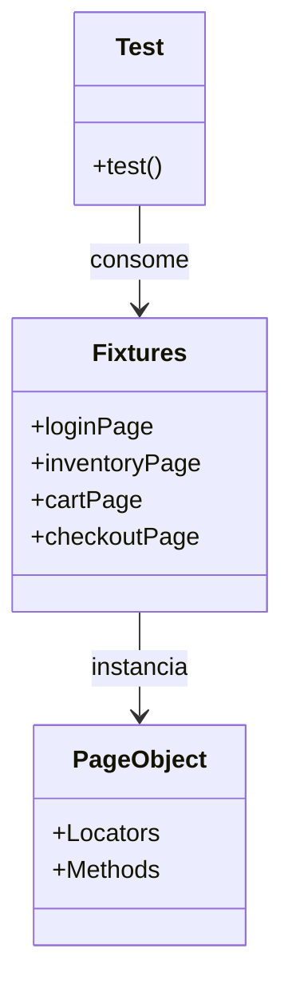

# 🎭 SauceDemo - Playwright Automation Pattern


> **Portfolio Project**: Demonstração de arquitetura robusta e escalável para automação de testes E2E.

[🔗 **Ver Relatório de Testes Online**](https://rfslusarz.github.io/saucedemo-automation-playwright/)  
*(Link disponível após a primeira execução da pipeline no GitHub Actions)*

---

## 🏗️ Arquitetura do Projeto

Este projeto utiliza **test fixtures** customizadas para injeção de dependência, garantindo testes limpos e desacoplados.



## 🧠 Decisões Técnicas

| Decisão | Por quê? |
|---------|----------|
| **Custom Fixtures** | Remove a repetição de `new Page(page)` nos testes, facilitando a escrita e manutenção. |
| **Page Object Model** | Separa a lógica de interação da página da lógica de testes. |
| **ESLint + Prettier** | Garante que o código siga padrões estritos de qualidade e formatação (essencial para times grandes). |
| **GitHub Actions** | Executa os testes automaticamente a cada Push/PR e publica o relatório na web. |
| **Allure Report** | Fornece visualização detalhada de passos, screenshots e histórico de execução. |

## 🚀 Como Executar

### Pré-requisitos
- Node.js 18+

### Instalação
```bash
npm install
npx playwright install --with-deps
```

### Comandos Principais
```bash
# Rodar todos os testes
npm test

# Rodar testes de Login
npm run test:login

# Rodar com interface visual (Debug)
npm run test:ui

# Verificar qualidade do código
npm run lint
```

## 📂 Estrutura de Pastas

```
.
├── .github/          # Configuração de CI/CD
├── fixtures/         # Injeção de Dependência Customizada
├── pages/            # Page Objects (Mapeamento de elementos e ações)
├── tests/            # Especificações de Teste (Specs)
├── utils/            # Funções auxiliares
├── .eslintrc.json    # Regras de Code Quality
├── playwright.yml    # Pipeline do GitHub Actions
└── package.json      # Dependências e Scripts
```
